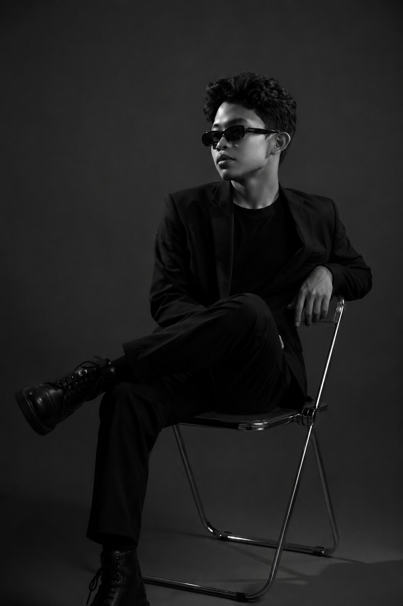
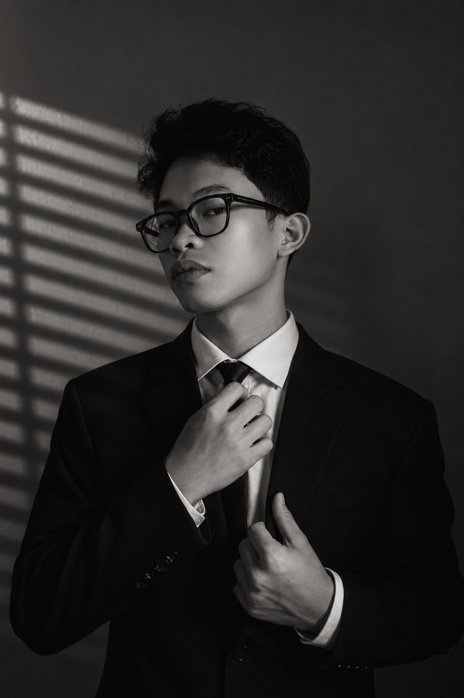
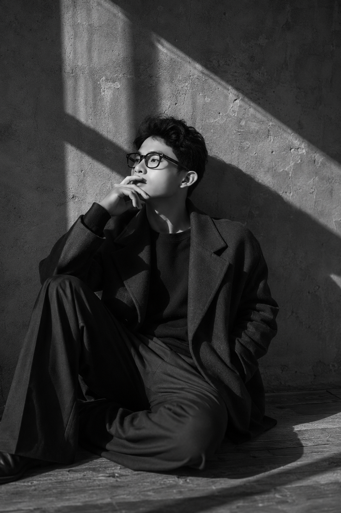

# TheFrans

Portfolio repository of modern restaurant, cafe, bar, and business websites built by Francis Tarectican.

Focused on immersive frontend experiences, cinematic layouts, motion systems, and modern business presentation.

---

## Live Website

🌐 https://frans15-2006.github.io/TheFrans/

---

# Featured Projects

## Brgy.Coffee
Modern coffee brand website with:
- parallax sections
- cinematic scrolling
- motion-based UI
- immersive typography

## Empire Cafe and Bar
Premium nightlife-inspired interface focused on atmosphere and visual identity.

## Izakaya-Tago
Japanese-inspired restaurant web experience with minimal layouts and immersive presentation.

## MK Sushi Bar Antipolo
Restaurant showcase with modern branding and responsive structure.

## Xin Chao
Vietnamese-inspired restaurant landing page with modern typography and smooth interaction systems.

## JO Coffee
Clean coffee business landing page with modern visual hierarchy.

## Mix Match Kain
Food business case-study style presentation focused on branding and layout systems.

## Summer Days
Experimental visual storytelling project using scroll-driven sections and aesthetic presentation.

---

# Repository Structure

```bash
/
├── Brgy.Coffee/
├── C&F-Food-House/
├── Empire-Cafe-and-Bar/
├── Izakaya-Tago/
├── JO-Coffee/
├── MK-Sushi-Bar-Antipolo/
├── Muyoo/
├── Tokamak/
├── divine-truffles/
├── igo-bikes/
├── mix-match-kain/
├── momentfood/
├── silog-bites/
├── summer-days/
├── xin-chao/
└── index.html
```

---

# Tech Stack

- HTML5
- CSS3
- JavaScript
- Responsive Design
- Motion UI
- Scroll Animations
- GitHub Pages

---

# Design Direction

The goal of these projects is to create websites that feel:
- immersive
- cinematic
- modern
- interactive
- visually memorable

The focus is not template-style websites.

Each project experiments with:
- motion systems
- layered layouts
- scroll behavior
- atmosphere-driven presentation
- branding-focused UI

---

# Screenshots

## Gallery





---

# Deployment

Hosted using GitHub Pages.

---

# Status

Ongoing frontend portfolio archive.
New projects, animations, UI systems, and interaction experiments are continuously added.

---

# Author

Francis A. Tarectican

GitHub:
https://github.com/frans15-2006

Portfolio:
https://frans15-2006.github.io/TheFrans/
